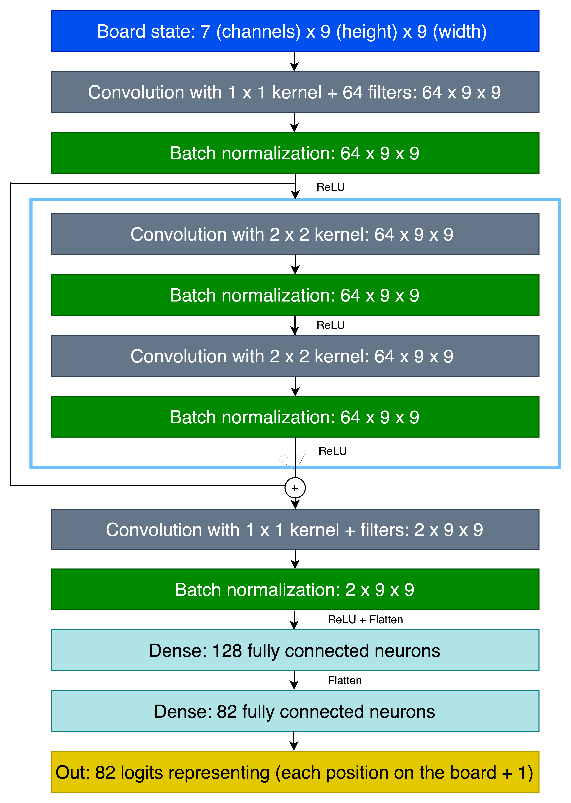

# SigmaGo

SigmaGo is a Go playing model for 9x9 board size. It is implemented using both reinforcement learning and supervised learning, inspired by the methods used by Google DeepMind on the AlphaGo.

## Running the Code

To train the model, first decompress the raw datasets using `decompress_datasets.py`. Then run `load_sgf` to parse the files into pickle files.

Proceed by running `policy_network.py`, adjusting parameters in the main function to your needs.

Once the `policy network` is trained, you can reinforce the model with the tree search algorithm. Run `goMCTS.py`, adjusting parameters in the main function to your needs.

## Environment

We created a custom environment for training the network. The state of the environment take inspiration from the [GymGo](https://github.com/huangeddie/GymGo) project
by representing game state in 7 layers, each being a 9x9 matrix. The layers are as following:

- Black: Matrix where each cell is 1 if occupied by a black stone; otherwise, 0.
- White: Matrix where each cell is 1 if occupied by a white stone; otherwise, 0.
- Turn: Matrix of all 0’s for Black’s turn and all 1’s for White’s turn.
- Invalid: Matrix with 1 for invalid moves and 0 for legal moves for the current player.
- Pass: Matrix of all 1’s if a player has passed, resetting to 0’s when the next move
is made.
- Done: Matrix of all 1’s if the game is over; otherwise, all 0’s.
- Board: matrix with 0 for black stones, 1 for white stones, and 0 for empty cells.

Due to the high complexity and variability in how final scores are determined in Go games, GNU Go was utilized to ensure consistent and standardized scoring.

## Training

### Policy Network
The policy network was trained on 46 422 professional 9x9 Go games from the Kifu dataset. Its architecture is described in the image below and takes inspiration from the [teeny-go](https://github.com/Gregory-Eales/teeny-go) project.

#### Datasets
- Kifu
    - https://www.dropbox.com/s/5wsrhr4pbtuygd6/go9-large.tgz
    - https://www.dropbox.com/s/dsdftx4kux2nezj/gokif2.tgz
    - https://www.dropbox.com/s/r4sdo2j4da0zuko/gokif3.tgz

### Monte Carlo Tree Search

To further improve the policy network, MCTS was used to evaluate and select moves based on the
winning probability for each move given by the policy network from the current board state.

#### Selection

The selection phase calculates a Upper Confidence Bound (UCB) value, evaluated with the following formula:

The algorithm then selects a random node from the top-N UCB scores according to softmax sampling.

#### Expansion

After the node is selected and a leaf node is reached, the expansion phase begins. One or more child nodes
are created, each child node representing a legal move from the leaf node. Each child node is given their own
probability distribution by the policy network.

#### Evaluation

Once the expansion is finished the search uses the value network to evaluate each child node. The valuation
is then backed up the tree, updating each node’s parent.
This process is simulated a specified number of times, after which the child node with the highest visit count
is selected as the optimal move.

## Results

Results indicate a weak correlation between both the number of games
played and the number of MCTS simulations and performance. SigmaGo consistently lost
to GNU Go, where factors like limited hardware and time for training might have influenced its
performance. The results indicate that better computational resources and longer training
time could improve performance.